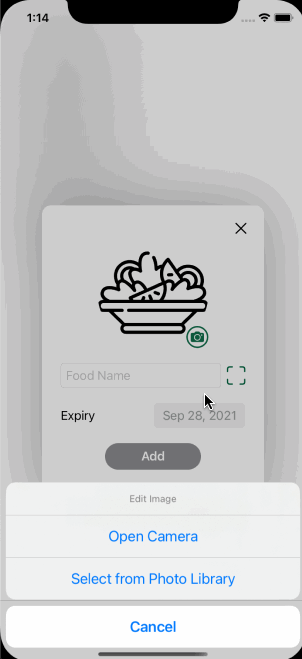

# NoWaster: A mobile app to help people reduce food waste

## Overview
This app was created along with my dissertation at Oxford Brookes university in 2021. It features shopping list management, inventory management, and food-sharing. Applied skills include **SwiftUI, UIKit, MapKit, CloudKit, Firebase**, etc. The following shows the demonstrations of each screen in the app.

### Sign-in screen
This screen allows users to **sign in with Apple or Google**.   

### Profile set-up screen
This screen requires a user to set up profile before using the app.   

### Shopping list screen
1. Add item
2. Delete item
3. Add item from history
4. Import to Inventory  

### Inventory screen
1. Add item 
2. Edit item
3. Extend expiry date by one day
4. Batch edition
5. Batch deletion
6. Gift items  

### Map screen
1. Check givers and available items
2. Retrieve items
3. Message a giver  

### Chat screen
1. View chats
2. Send text message  

### Profile screen
1. Update profile
2. Sign out  

